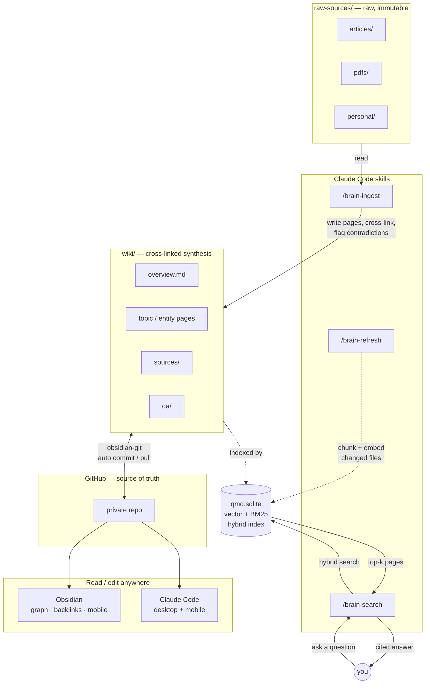

claude-second-brain connects four tools into a single, coherent pipeline. Sources flow in on the left, Claude synthesizes them into a structured wiki, qmd indexes every page into a local hybrid search index, and GitHub makes the whole vault editable from Obsidian and Claude Code on any device. Nothing in this pipeline is optional — each component does a job none of the others can.

## Full data flow

The diagram below shows every component and how they connect. Solid arrows are read/write operations; dashed arrows are indexing operations that happen in the background.



## The ingest loop

When you run `/brain-ingest`, Claude reads the source file, extracts key knowledge, creates a structured summary page under `wiki/sources/`, and then propagates that knowledge into every related topic and entity page in the wiki. Contradictions with existing pages are flagged in place — you always know when two sources disagree.

```
┌─────────────────────┐        ┌─────────────────────┐        ┌─────────────────────┐
│   Drop in a source  │        │ /brain-ingest       │        │     Wiki grows      │
│                     │        │                     │        │                     │
│  · article          │──────▶ │  reads + extracts   │──────▶ │  · cross-linked     │
│  · PDF              │        │  key knowledge      │        │    pages            │
│  · personal note    │        │                     │        │  · contradictions   │
│                     │        │                     │        │    flagged          │
└─────────────────────┘        └─────────────────────┘        │  · syntheses        │
                                                              │    written          │
                                                              └─────────────────────┘
```

After ingesting, query the wiki anytime with `/brain-search`. You get an answer with inline `[[wiki/page]]` citations drawn from the pages Claude already built — not a list of files to re-read yourself.

## Directory layout

The vault has a clear separation of concerns. `raw-sources/` is immutable — Claude never modifies anything there. `wiki/` is Claude's territory entirely.

```
my-brain/
├── CLAUDE.md              ← The schema. Claude reads this every session.
├── raw-sources/           ← Your raw inputs. Claude never modifies these.
│   ├── articles/
│   ├── pdfs/
│   └── personal/
├── wiki/                  ← Claude owns this entirely.
│   ├── index.md
│   ├── log.md
│   ├── overview.md
│   ├── sources/
│   └── qa/
└── scripts/qmd/           ← Semantic search setup and re-indexing
```

`CLAUDE.md` is the operating schema — it defines every page type, frontmatter format, naming convention, and workflow. Claude reads it at the start of every session, which is what makes the wiki consistent over time even across separate Claude Code sessions.

## What it is vs. what it isn't

Understanding this distinction is important for setting the right expectations.

| | claude-second-brain | RAG system / chatbot |
|---|---|---|
| **Knowledge representation** | Structured wiki pages with YAML frontmatter, cross-links, and synthesis | Raw chunks in a vector store |
| **Contradictions** | Flagged in place with `[!WARNING]` callouts | Invisible — both versions retrieved |
| **Persistence** | Wiki grows and compounds with every ingest | Index grows, but no synthesis |
| **Querying** | `/brain-search` returns cited answers from wiki pages Claude wrote | Retrieval-augmented generation from raw chunks |
| **Maintenance** | `/lint` surfaces orphans, broken links, and data gaps | None — index is static |

This is an actively maintained knowledge base, not a retrieval layer over your raw files. Claude reads sources, synthesizes them, and maintains the wiki — you read the wiki and ask questions against it.

## Related pages

<Card title="Wiki schema" icon="file-lines" href="/wiki/schema">
  The five page types, frontmatter format, and naming conventions Claude uses to maintain the wiki.
</Card>

<Card title="/brain-ingest" icon="file-import" href="/skills/brain-ingest">
  Full workflow for how Claude reads a source and integrates it into the wiki.
</Card>

<Card title="/brain-search" icon="magnifying-glass" href="/skills/brain-search">
  How hybrid semantic search works and how cited answers are generated.
</Card>
